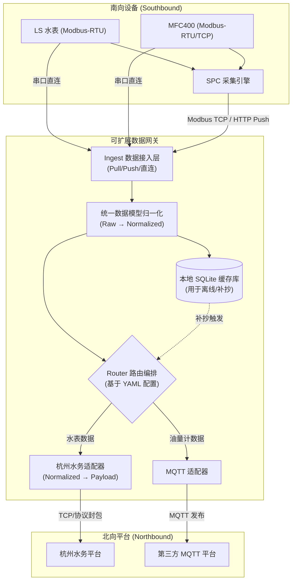

## 1. 产品概述
可扩展数据网关（南向N设备 × 北向N平台）—以“杭州水务”为示例平台。
- 解决南向N种设备/协议与北向N种平台/协议对接的问题，支持按配置编排数据流。
- 提升系统扩展性，通过三层架构（Raw → Normalized → Platform Payload）实现数据统一与灵活适配。

## 2. 核心特性

### 2.1 模块化架构
| 模块名称 | 职责描述 |
|------|------------------|
| Southbound / Ingest 插件 | 负责数据接入（SPC Pull/Push、直连 Modbus、直连私有串口协议等） |
| Northbound / Egress 插件 | 负责对接第三方平台（如杭州水务、MQTT平台、HTTP平台等） |
| Router（路由与编排） | 基于配置规则实现数据流的分发（1→N, N→1, N→N） |

### 2.2 数据接入模式
1. **模式 A**: 从 SPC 的 Modbus TCP Slave 读取（Pull）
2. **模式 B**: SPC 配置 HTTP JSON POST 到网关 HTTP 服务（Push）
3. **模式 C**: 网关程序直接采集 Modbus-RTU 设备（Bypass SPC）
4. **模式 D**: 网关程序直接采集 Modbus-TCP 设备
5. **模式 E**: 直接读取 SPC 的 SQLite3 历史库（可选）

### 2.3 平台适配特性 (杭州水务示例)
| 特性名称 | 默认配置 | 描述 |
|-----------|-------------|---------------------|
| 连接方式 | TCP 短连接 | 每次上线/补抄/心跳按协议建立连接，超时 60s |
| 表地址编码 | 8字节 BCD | [表类型(1) + 表序号(5) + 厂商代码(2)] |
| 上报间隔 | 15分钟 | 定时上报聚合数据，内部采集可保持更高频 |
| 缺省值处理 | 自动补全 | 缺失压力、电压等字段时自动使用缺省值 |

## 3. 核心流程
南向设备数据经过网关接入，进行标准化处理后，根据路由配置发送到北向平台，支持离线缓存和断点续传。

## 4. 统一数据模型设计
内部统一的数据记录包含以下核心字段：
- `ts`：时间戳
- `flow_instant_m3h`：瞬时流量（m³/h）
- `forward_total_m3`：正向累计（m³）
- `reverse_total_m3`：反向累计（m³）
- `pressure`：压力（缺省 0）
- `power_comm_v / power_meter_v`：电压（缺省 0/0）
- `st_word`：状态字（缺省 0）

## 5. 运维与诊断 CLI 工具
提供强大的 `gwctl` 命令行工具用于本地调试：
- 串口与连通性诊断 (`gwctl serial test`, `gwctl modbus rtu read`)
- 点表管理 (`gwctl points list`, `gwctl points import`)
- 采集与联调 (`gwctl poll once`, `gwctl ingest http-server start`)
- 协议报文诊断 (`gwctl hzws encode`, `gwctl hzws decode`)
- 缓存与日志诊断 (`gwctl db stats`, `gwctl logs grep`)