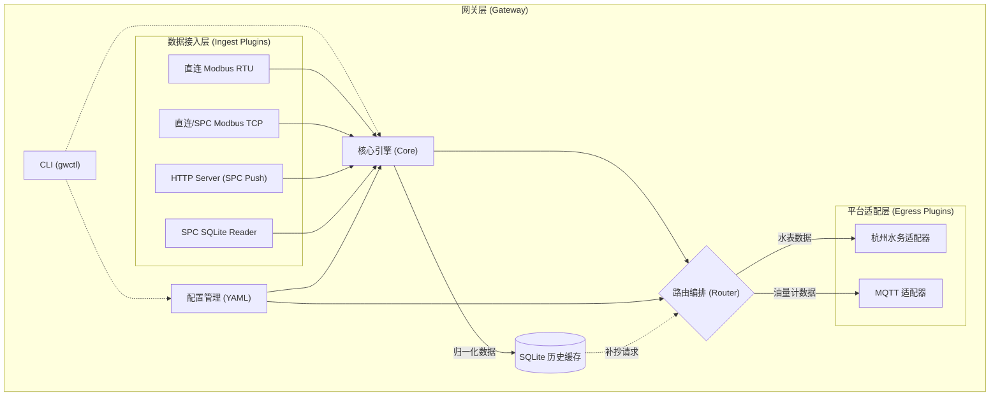
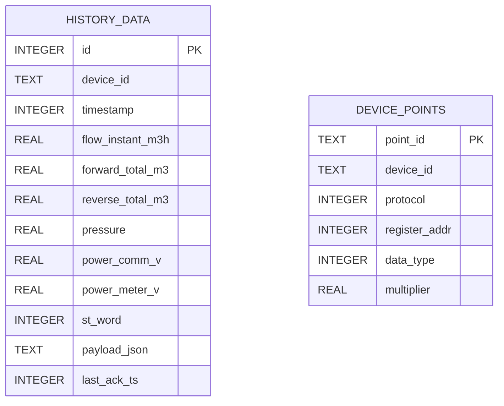

## 1. 架构设计


## 2. 技术栈说明
- **语言框架**: Go 1.21+ (推荐用于构建高性能、低依赖的跨平台网关) 或 Rust
- **依赖库**:
  - Modbus: `github.com/simonvetter/modbus` (Go) 或 `tokio-modbus` (Rust)
  - HTTP Server: `net/http` (Go) 或 `axum` (Rust)
  - 数据库: `github.com/mattn/go-sqlite3` (Go) 或 `rusqlite` (Rust)
  - 配置解析: `gopkg.in/yaml.v3` (Go) 或 `serde_yaml` (Rust)
  - CLI: `github.com/spf13/cobra` (Go) 或 `clap` (Rust)

## 3. 核心接口定义
### 3.1 统一数据模型 (Normalized Data)
```go
type NormalizedData struct {
    Timestamp       time.Time `json:"ts"`
    DeviceID        string    `json:"device_id"`
    FlowInstantM3H  float64   `json:"flow_instant_m3h"`
    ForwardTotalM3  float64   `json:"forward_total_m3"`
    ReverseTotalM3  float64   `json:"reverse_total_m3"`
    Pressure        float64   `json:"pressure"`
    PowerCommV      float64   `json:"power_comm_v"`
    PowerMeterV     float64   `json:"power_meter_v"`
    StatusWord      uint32    `json:"st_word"`
    Tags            map[string]string `json:"tags"`
}
```

### 3.2 插件接口定义
```go
// Ingest 插件接口
type IngestPlugin interface {
    Start(ctx context.Context, ch chan<- NormalizedData) error
    Stop() error
}

// Egress 插件接口
type EgressPlugin interface {
    Start(ctx context.Context) error
    Send(data NormalizedData) error
    Stop() error
}
```

## 4. 路由配置示例 (YAML)
```yaml
ingest:
  mode: spc_modbus_tcp_slave
  spc_modbus_tcp_slave:
    host: 127.0.0.1
    port: 502
    unit_id: 1

device:
  interval_seconds: 10
  report_interval_minutes: 15

hzws:
  server_host: 127.0.0.1
  server_port: 9000
  meter_id_bcd8: "10-00-00-00-00-01-36-01"

routes:
  - name: water_to_hzws
    match:
      device_tags: [water_meter]
    transform:
      profile: water_v1
    outputs:
      - type: hzws
        target: default
```

## 5. 数据模型设计 (SQLite)
### 5.1 数据模型定义


### 5.2 DDL 语句
```sql
CREATE TABLE IF NOT EXISTS history_data (
    id INTEGER PRIMARY KEY AUTOINCREMENT,
    device_id TEXT NOT NULL,
    timestamp INTEGER NOT NULL,
    flow_instant_m3h REAL DEFAULT 0,
    forward_total_m3 REAL DEFAULT 0,
    reverse_total_m3 REAL DEFAULT 0,
    pressure REAL DEFAULT 0,
    power_comm_v REAL DEFAULT 0,
    power_meter_v REAL DEFAULT 0,
    st_word INTEGER DEFAULT 0,
    payload_json TEXT,
    last_ack_ts INTEGER DEFAULT 0
);

CREATE INDEX idx_history_device_ts ON history_data(device_id, timestamp);
CREATE INDEX idx_history_ack ON history_data(last_ack_ts);
```